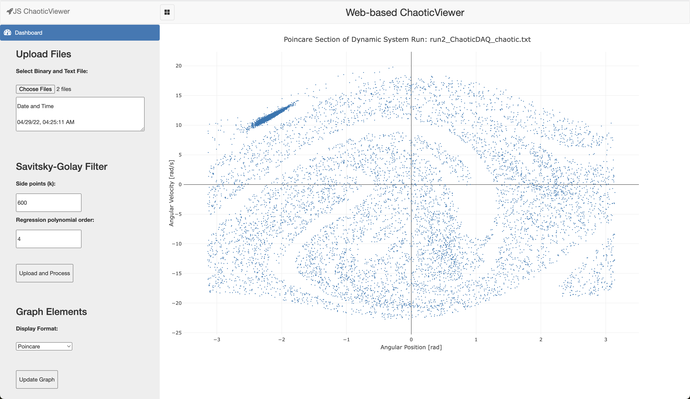

# PHYS 323: WP3 (Final Presentation) Web-based ChaoticViewer

## Project Overview

Project Assignment Outline PDF: [project_assignment.pdf](docs/project_assignment.pdf)  

## Project Description

The main purpose of this project is to demonstrate the implementation of a web-based ChaoticViewer similar to the Virtual Instrumentation (VI) that was created in LabView. This program allows users to select a binary (.bin) file (i.e., data created with the ChaoticDAQ VI program) to load into the web interface. Each binary file has an associated text (.txt) file that is loaded in and referrenced for viewing configuration.

## Installation Process and Execution
1. Visit [https://benfrey.github.io/phys323-chaotic-viewer/public/](https://benfrey.github.io/phys323-chaotic-viewer/public/)
2. Select both the .bin and .txt file simultaneously
2. Click the "Upload and Process" button

## Runtime Demonstration
Screenshot of a large binary file being uploaded (~1.02GB). Data is from a chaotic dynamic system.

